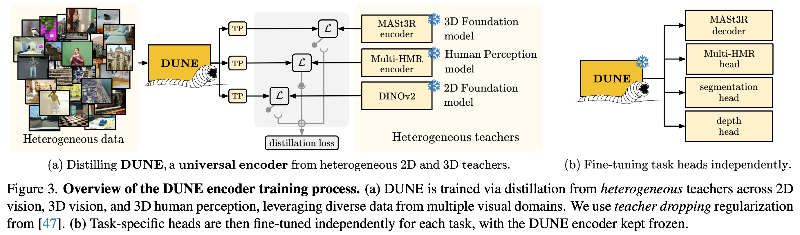
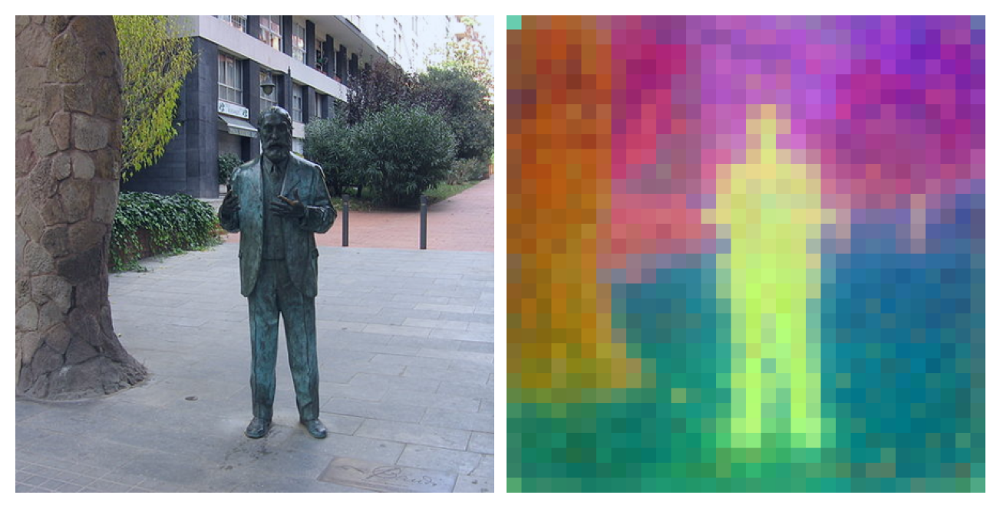

<div align="center">
<h1>DUNE: Distilling a Universal Encoder from Heterogeneous 2D and 3D Teachers</h1>

[**Mert Bulent Sariyildiz**](https://mbsariyildiz.github.io/) · [**Philippe Weinzaepfel**](https://europe.naverlabs.com/people_user_naverlabs/philippe-weinzaepfel/) · [**Thomas Lucas**](https://europe.naverlabs.com/people_user_naverlabs/thomas-lucas/) · [**Pau de Jorge**](https://europe.naverlabs.com/people_user_naverlabs/pau-de-jorge/) · [**Diane Larlus**](https://europe.naverlabs.com/people_user_naverlabs/diane-larlus/) · [**Yannis Kalantidis**](https://europe.naverlabs.com/people_user_naverlabs/yannis-kalantidis/)

NAVER LABS Europe

**CVPR 2025**

[[ArXiv](https://arxiv.org/abs/2503.14405)] · [[Citation](#citation)]

</div>

<!-- omit in toc -->
# Easy navigation

- [Model overview](#summary)
- [Pre-trained models](#pre-trained-models)
- [Installation](#installation)
  - [Conda environment](#conda-environment)
  - [Teacher models](#teacher-models)
  - [Distillation datasets](#distillation-datasets)
- [Training models](#training-models)
- [Evaluating models](#evaluating-models)
- [PCA visualization](#pca-visualization)
- [Citation](#citation)

# Summary

DUNE is a vision encoder trained via multi-teacher distillation. Specifically, DUNE encoders are distilled using three heterogeneous pre-trained vision models as teachers: [DINOv2](https://github.com/facebookresearch/dinov2/), [MASt3R](https://github.com/naver/mast3r) and [Multi-HMR](https://github.com/naver/multi-hmr). We use [19 datasets](https://oss.navercorp.com/bulent-sariyildiz/dune#distillation-datasets) for distillation, covering the visual domains of all three teachers and comprising approximately 20.7 million images in total. The full list of datasets is provided [below](https://oss.navercorp.com/bulent-sariyildiz/dune#distillation-datasets) and also provided in Table 5 of the paper. For all teachers, we used their publicly available ViT-Large checkpoints.

By using DUNE, you can achieve strong performance on a range of 2D and 3D downstream tasks, like monocular depth, semantic segmentation, multi-view depth estimation, multi-human mesh recovery, multi-view pose regression and 3D reconstruction. Notably, MASt3R model with a DUNE encoder achieves [a new state-of-the art performance in Map-free Visual Relocalization](https://research.nianticlabs.com/mapfree-reloc-benchmark/leaderboard?t=single&f=all), improving over the original MASt3R with a much smaller encoder.


## Model overview



# Pre-trained models

| Architecture           | Resolution | Checkpoint                                                                                                      | Sem.Seg. ADE20K | Sem.Seg. CityScapes | Sem.Seg. NYU | Sem.Seg. Scannet | Depth NYUd | BEDLAM (PA-PVE) | MapFree (AUC) |
|------------------------|------------|------------------------------------------------------------------------------------------------------------------|------------------|----------------------|----------------|-------------------|-------------|----------------|----------------|
| ViT-Base/14 (420MB)   | 336        | [dune_vitbase14_336.pth](https://download.europe.naverlabs.com/dune/dune_vitbase14_336.pth)                    | 45.0             | 69.3                 | 66.9           | 64.6              | 0.384       | 64.3                    | 94.1
| ViT-Base/14           | 448        | [dune_vitbase14_448.pth](https://download.europe.naverlabs.com/dune/dune_vitbase14_448.pth)                    | **46.2**             | **71.3**                 | **68.3**          | **65.4**              | 0.365       | 60.1           | 94.2
| ViT-Base/14*           | 448        | [dune_vitbase14_448_paper.pth](https://download.europe.naverlabs.com/dune/dune_vitbase14_448_paper.pth)        | 45.6             | 70.6                 | 68.2           | 65.2              | **0.358**       | **56.0**        | **94.7**           |
* *Model reported in the paper and trained using an earlier (internal) version of this codebase.

| Architecture           | Resolution | Checkpoint                                                                                                      | Sem.Seg. ADE20K | Sem.Seg. CityScapes | Sem.Seg. NYU | Sem.Seg. Scannet | Depth NYUd | BEDLAM (PA-PVE) | MapFree (AUC) |
|------------------------|------------|------------------------------------------------------------------------------------------------------------------|------------------|----------------------|----------------|-------------------|-------------|----------------|----------------|
| ViT-Small/14 (110MB)  | 336        | [dune_vitsmall14_336.pth](https://download.europe.naverlabs.com/dune/dune_vitsmall14_336.pth)                  | 39.6             | 61.7                 | 63.5           | 60.1              | 0.424       | _WIP_              | _WIP_               |
| ViT-Small/14          | 448        | [dune_vitsmall14_448.pth](https://download.europe.naverlabs.com/dune/dune_vitsmall14_448.pth)                  | 41.4             | 63.7                 | 65.5           | 61.2              | 0.404       | _WIP_              | _WIP_                |

- WIP: Work in progress.
- Semantic segmentation results in the table (Sem.Seg.) are obtained after DINOv2 projectors, following the convention in the paper.

After download a pre-trained model, you can easily load it via:
```Python
from model.dune import load_dune_from_checkpoint
model = load_dune_from_checkpoint("./dune_vitbase14_448_paper.pth")
```


# Installation

## Conda environment

- Create a conda environment with all the necessary packages.

```bash
env_name="dune"
conda create -n ${env_name}
conda activate ${env_name}
conda install python=3.12
pip install -U torch=='2.7.0' torchvision torchfix timm 'huggingface_hub>=0.22' transformers accelerate einops torchmetrics optuna tensorboard matplotlib pandas jaxtyping scikit-learn-intelex omegaconf opencv-python ipython black flake8 pylint rich ipykernel
```

- Set the path of your conda in [scripts/setup_env.sh](./scripts/setup_env.sh), i.e. update the `conda_dir` variable.
Then your environment will be automatically used by the training script.


## Teacher models

- To download the teacher models we used in this work, you can check the bash scripts under the [scripts/teachers](./scripts/teachers) folder.
To download all teachers at once, use [scripts/teachers/prepare_all.sh](./scripts/teachers/prepare_all.sh):
```bash
# BEFORE EXECUTING THIS COMMAND, MAKE SURE TO SEE THE CONTENTS OF THE SCRIPTS!
(cd scripts/teachers && ./prepare_all.sh <path_to_download_directory>)
```

- Once teacher checkpoints are downloaded, update the `ckpt_path` keys in the `TEACHER_CFG` dictionary in [teachers/config.py](teachers/config.py) to point to the correct paths.
For MASt3R, the preparation script mentioned above will additionally clone the MASt3R repository.
You also need to set the `code_dir` in `TEACHER_CFG` key to point to the directory where this MASt3R repo is located.

## Distillation datasets

We train DUNE models on the combination of 19 datasets with roughly 20.7M images.
The full list of datasets is available below, and in Table 5 of the paper.
We provide the dataloaders for these datasets in [data/dino2.py](data/dino2.py), [data/mast3r.py](data/mast3r.py) and [data/multihmr.py](data/multihmr.py) for details.
However, we leave the downloading and preprocessing of the datasets to the user.
Once you have the datasets, set their paths in [data/paths.py](data/paths.py)

If downloading the 19 datasets is too cumbersome, it is also possible to train DUNE on ImageNet-1K only.
To do that, set the `IN1K_DIRS` variable in [data/paths.py](data/paths.py) to the path of your ImageNet-1K.


### Table of datasets 

| Name              | Size       | Nature     |
|-------------------|------------|------------|
| ImageNet-19K      | 13,153,480 | Real       |
| Mapillary         | 1,205,907  | Real       |
| Google Landmarks v2 | 4,132,914  | Real       |
| Habitat           | 284,968    | Rendered   |
| ARKitScenes       | 456,108    | Rendered   |
| Blended MVS       | 98,937     | Rendered   |
| MegaDepth         | 36,949     | Real       |
| ScanNet++         | 60,188     | Rendered   |
| CO3D-v2           | 185,100    | Real       |
| Map-free          | 41,300     | Real       |
| WildRgb           | 224,400    | Real       |
| VirtualKitti      | 1,200      | Synthetic  |
| Unreal4K          | 14,386     | Synthetic  |
| TartanAir         | 136,225    | Real       |
| DL3DV             | 208,800    | Rendered   |
| BEDLAM            | 353,118    | Synthetic  |
| AGORA             | 14,314     | Synthetic  |
| CUFFS             | 54,944     | Synthetic  |
| UBody             | 54,234     | Real       |


# Training models

DUNE follows a two-stage training: Initial pre-training at resolution 336 for 100 "epochs", and fine-tuning at resolution 448 for 50 epochs.
We define an epoch by 1281167 images, as the size of the ImageNet-1K dataset.

```bash
# Pre-training at resolution 336
# To distill only on ImageNet-1K, pass --dataset="in1k" to the script
output_dir_pretrain="/path/to/dune/pretrain/dir/"
bash ./scripts/train.sh ${output_dir_pretrain}

# Fine-tuning at resolution 448
# Adjust batch size according to your GPU memory
output_dir_finetune="/path/to/dune/finetune/dir/"
bash ./scripts/train.sh ${output_dir_finetune} \
    --pretrained=${output_dir_pretrain}/checkpoint.pth \
    --image_size=448 \
    --lr=5e-5 \
    --epochs=50 \
    --batch_size_per_gpu=128
```

# Evaluating models

We do not provide evaluation scripts for the downstream tasks.
We kindly ask you to refer to the original repositories of the downstream tasks for evaluation:
- https://github.com/facebookresearch/dinov2
- https://github.com/naver/mast3r
- https://github.com/naver/multi-hmr

# PCA visualization

We provide an example script [scripts/pca_vis.py](scripts/pca_vis.py), which shows how to load the encoder part of the DUNE model and visualize the PCA output of its patch features.
To execute this script:
```bash
PYTHONPATH=${PWD}:${PYTHONPATH} python scripts/pca_vis.py
```

This will generate a PCA visualization of the patch features of the best DUNE model reported in the paper on a test image.


# Citation

If you find this repository useful, please consider citing us:

```LaTeX
@inproceedings{sariyildiz2025dune,
    title={{DUNE}: Distilling a Universal Encoder from Heterogeneous {2D} and {3D} Teachers},
    author={Sariyildiz, Mert Bulent and Weinzaepfel, Philippe and Lucas, Thomas and De Jorge, Pau and Larlus, Diane and Kalantidis, Yannis},
    booktitle={IEEE Conference on Computer Vision and Pattern Recognition (CVPR)},
    year={2025},
}
```
